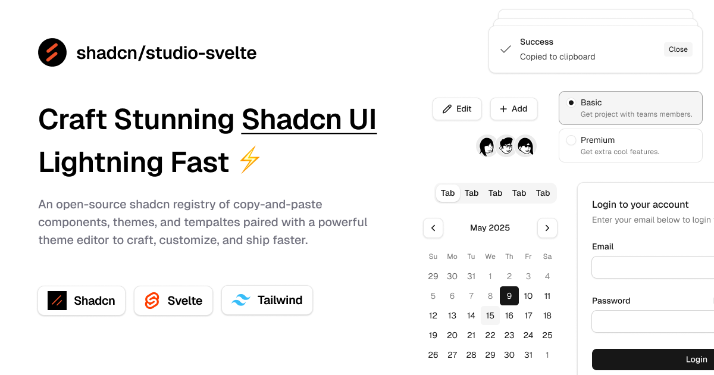

 
 <h1 align="center">
  shadcn/studio-svelte
 </h1>

[shadcn/studio-svelte](https://shadcnstudio-svelte.netlify.app) is an unofficial community-led [Svelte](https://svelte.dev) port of [shadcn/studio](https://shadcnstudio.com/?ref=mfoMfp).

> **Note**   **This project is not affiliated with shadcn/studio**  

[shadcn/studio-svelte](https://shadcnstudio-svelte.netlify.app) is an open-source collection of copy-and-paste shadcn components, blocks, and templates - paired with a powerful theme generator to craft, customize, and ship faster. 🚀

## Documentation

Visit https://shadcnstudio-svelte.netlify.app/docs/getting-started/introduction to view the documentation.

## Support

If you're planning to pick up **shadcn/studio**, you can sign up through my [referral link](https://shadcnstudio.com/?ref=mfoMfp). I'll receive a small commission at no extra cost to you.

## Credits

We are grateful for the contributions of the open-source community, particularly:

- [shadcn/studio](https://shadcnstudio.com/?ref=mfoMfp) (Original project)
- [shadcn-svelte](https://shadcn-svelte.com) & [bits-ui](https://bits-ui.com) (Svelte port of shadcn/ui, providing the foundational components)
- [motion-svelte](https://github.com/hanielu/motion-svelte) (Svelte port of Framer Motion, powering our animations)
- [tweakcn](https://tweakcn.com/) (Our theme generator is heavily inspired by tweakcn)

These projects form the backbone of shadcn/studio-svelte, allowing us to build powerful copy-and-paste components.

## License

Licensed under the [MIT license](https://github.com/EpicAlbin03/shadcn-studio-svelte/blob/main/LICENSE.md).
